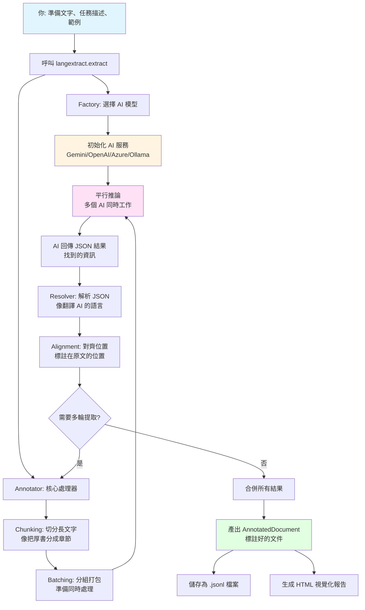

# LangExtract 專案說明

**專案名稱**：LangExtract  
**專案網頁**：<https://github.com/google/langextract>  
**參考網頁**：<https://deepwiki.com/google/langextract>

---

## 1. 專案用途與核心解析

### 用途與核心功能

想像一下，你正在讀一本厚厚的小說，老師要你找出所有出現的人物、他們住在哪裡，以及他們之間的關係。如果手動翻書找，可能要花好幾個小時，而且很容易漏掉一些細節。

**LangExtract** 就像一個超級聰明的閱讀助手，它能幫你自動「讀完」整本書，然後根據你的指示，把所有重要的資訊都「挖出來」，整理成一個清楚的表格。

**它解決了什麼痛點？**

在真實世界中，我們常常需要從大量文字中找出特定資訊：
- 📚 **研究報告**：從幾百頁的市場分析報告中，找出所有提到的公司名稱和產品
- 💬 **客戶回饋**：從上千則用戶評論中，找出大家抱怨的功能和建議
- 🏥 **醫療記錄**：從醫生的手寫病歷中，提取藥物名稱、劑量和治療方案
- 📖 **文學分析**：從小說中找出所有角色的對話和情感變化

如果用人眼一個字一個字看，不僅耗時，還容易出錯。LangExtract 用 AI 幫你自動完成這件事，而且它有個超厲害的功能：**每一筆找到的資訊，它都會告訴你「這段話在原文的第幾個字到第幾個字」**，就像在書上畫重點一樣，讓你可以隨時回去檢查！

### 實際應用場景

讓我們用一個具體的故事來說明：

**情境**：小華是圖書館的實習生，館長要他整理 100 本小說，找出每本書中：
- 所有主角的名字
- 故事發生的地點
- 主角們的情感狀態（開心、難過、憤怒等）

如果小華手動整理，可能需要好幾個月。但使用 LangExtract，他只需要：

1. 告訴 LangExtract：「請從這些小說中找出人物、地點和情感」
2. 給它看一個範例：「這本書的主角是 Romeo，他住在 Verona，他感到憂傷」
3. 把 100 本小說的文字檔丟給它

幾分鐘後，LangExtract 就會給小華一個完整的表格，列出每本書的所有資訊，而且每一筆資訊都標註了「這段話在第幾頁第幾行」，讓小華可以隨時回去驗證！

---

## 2. 輸入與輸出 (I/O) 解析

### Input（輸入）

LangExtract 需要三樣東西才能開始工作：

1. **原始文字**：你想要分析的內容
   - 可以是一段話、一篇文章，甚至整本書
   - 也可以直接給它一個網址，它會自動下載內容

2. **任務描述**：用簡單的話告訴它「你想找什麼」
   - 例如：「請找出所有人物姓名和他們居住的城市」
   - 就像給一個助手下指令一樣

3. **範例**：給它看一兩個例子，讓它更懂你的需求
   - 就像教同學做題目時，先給他看一個範例題
   - 例如：給它看「Romeo 住在 Verona」，它就知道「人物」和「地點」是什麼意思

### Output（輸出）

LangExtract 會給你一個「標註好的文件」，裡面包含：

1. **提取結果列表**：所有找到的資訊
   - 每筆資訊都有「類別」（例如：人物、地點）
   - 還有「屬性」（例如：人物的家族、地點的國家）

2. **精確位置標註**：每筆資訊在原文中的位置
   - 就像告訴你「這段話在第 5 行的第 10 個字到第 15 個字」
   - 讓你可以隨時回去原文檢查

3. **視覺化報告**：一個漂亮的 HTML 網頁
   - 所有找到的資訊會在原文中被「高亮標示」
   - 滑鼠移過去就能看到詳細資訊

### 舉例說明

**如果我輸入**：
```
文字：「Romeo 是 Montague 家族的成員，他愛上了 Capulet 家族的 Juliet。他們在 Verona 相遇。」

任務描述：「請找出所有人物、他們的家族，以及故事發生的地點。」

範例：給它看「Romeo 屬於 Montague 家族」
```

**系統會經過處理**：
1. AI 閱讀文字
2. 根據任務描述和範例，理解要找什麼
3. 在文字中找出符合條件的資訊
4. 標註每筆資訊在原文中的精確位置

**最終給我**：
```json
{
  "人物": "Romeo",
  "家族": "Montague",
  "位置": "第 0 個字到第 5 個字"
},
{
  "人物": "Juliet",
  "家族": "Capulet",
  "位置": "第 35 個字到第 41 個字"
},
{
  "地點": "Verona",
  "位置": "第 45 個字到第 51 個字"
}
```

**這可以幫助我**：
- 快速整理大量文字資料
- 確保每筆資訊都有來源依據（可以回去原文檢查）
- 自動化原本需要人工花很多時間的工作

---

## 3. LLM 應用分析

### 模型識別

LangExtract 就像一個「AI 模型選擇器」，它可以連接多種不同的 AI 大腦：

1. **Google Gemini**：Google 開發的 AI 模型
   - 例如：`gemini-2.5-flash`（快速版）、`gemini-2.5-pro`（高品質版）

2. **OpenAI GPT**：ChatGPT 背後的技術
   - 例如：`gpt-4o`、`gpt-4o-mini`

3. **Azure OpenAI**：微軟雲端服務提供的 OpenAI 模型
   - 適合企業使用，有更好的隱私保護

4. **Ollama**：可以在自己電腦上運行的開源模型
   - 免費，但需要較強的電腦硬體
   - 例如：`llama3`、`gemma2:2b`

5. **自訂外掛**：如果你有其他 AI 服務，可以自己寫程式連接

### 應用環節

**AI 模型在這個專案中扮演什麼角色？**

想像 LangExtract 是一個「智慧閱讀工廠」：

1. **你**：給工廠一張「訂單」（任務描述 + 範例）
2. **工廠管理員**（LangExtract）：把訂單拆解成小任務
3. **AI 工人**（LLM）：負責「閱讀」和「理解」文字，找出符合條件的資訊
4. **品質檢查員**（Resolver）：檢查 AI 找出來的資訊是否正確
5. **包裝員**：把結果整理成表格，標註位置

**具體來說，AI 負責什麼？**

- **理解指令**：讀懂你給的任務描述和範例
- **分析文字**：閱讀文字片段，找出符合條件的資訊
- **產生結果**：以 JSON 格式回傳找到的資訊

就像一個超級聰明的助手，你告訴它「找出所有人物」，它就能在文字中找到所有人物名稱！

### 結果舉例

**AI 在這個環節產出了什麼？**

假設你給 AI 一段文字：
```
"Romeo 在 Verona 感到憂傷，因為他愛上了 Juliet。"
```

AI 會分析這段話，然後產出類似這樣的結果：
```json
{
  "extractions": [
    {
      "extraction_class": "character",
      "extraction_text": "Romeo",
      "attributes": {"emotion": "憂傷"},
      "char_interval": [0, 5]
    },
    {
      "extraction_class": "location",
      "extraction_text": "Verona",
      "char_interval": [6, 12]
    },
    {
      "extraction_class": "character",
      "extraction_text": "Juliet",
      "char_interval": [25, 31]
    }
  ]
}
```

這就是 AI 的「工作成果」：它找到了 2 個人物（Romeo、Juliet）和 1 個地點（Verona），還標註了每筆資訊在原文中的位置！

---

## 4. 配置參數影響分析

### 自動掃描結果

透過分析程式碼，我發現 LangExtract 有許多可以調整的參數，它們就像「控制面板」上的各種開關，調整它們會影響系統的行為：

### 重要參數說明

#### 1. `model_id`（AI 模型選擇）⭐ 最重要

**預設值**：`"gemini-2.5-flash"`

**調整它會發生什麼事？**
- 就像選擇不同的「AI 助手」來幫你工作
- **選擇快速模型**（如 `gemini-2.5-flash`）：速度快、成本低，但可能不夠精確
- **選擇高品質模型**（如 `gemini-2.5-pro`）：結果更準確，但速度慢、成本高
- **選擇本地模型**（如 `ollama/llama3`）：免費，但需要強大的電腦

**生活化比喻**：就像選擇交通工具
- 快速模型 = 機車：快、便宜，但載重有限
- 高品質模型 = 高鐵：舒適、準確，但較貴
- 本地模型 = 腳踏車：免費，但需要體力（電腦效能）

#### 2. `extraction_passes`（提取輪數）

**預設值**：`1`

**調整它會發生什麼事？**
- 就像「檢查幾遍」的概念
- **設為 1**：只檢查一遍，速度快但可能漏掉一些資訊
- **設為 2 或 3**：重複檢查，找到更多資訊，但花更多時間和錢

**生活化比喻**：就像考試檢查答案
- `extraction_passes=1`：寫完就交卷
- `extraction_passes=3`：檢查 3 遍才交卷，更不容易出錯

#### 3. `max_workers`（平行處理數量）

**預設值**：`10`

**調整它會發生什麼事？**
- 就像「同時派幾個工人」來處理工作
- **設為 1**：一次只處理一個任務，慢但穩定
- **設為 20**：同時處理 20 個任務，快但需要更多資源

**生活化比喻**：就像餐廳的服務生數量
- `max_workers=1`：只有 1 個服務生，客人要等很久
- `max_workers=20`：有 20 個服務生，服務超快，但廚房可能忙不過來

#### 4. `max_char_buffer`（文字片段大小）

**預設值**：`1000`（字元）

**調整它會發生什麼事？**
- 就像「一次給 AI 看多少字」
- **設為 500**：每次只看 500 字，AI 更專注，但需要更多次 API 呼叫
- **設為 2000**：每次看 2000 字，減少 API 呼叫，但 AI 可能分心

**生活化比喻**：就像讀書時一次讀幾頁
- `max_char_buffer=500`：一次讀 1 頁，很專注但讀得慢
- `max_char_buffer=2000`：一次讀 4 頁，讀得快但可能漏掉細節

#### 5. `temperature`（創意溫度）

**預設值**：`None`（使用模型預設值，通常是 `0.0`）

**調整它會發生什麼事？**
- 控制 AI 的「創意程度」或「隨機性」
- **設為 0.0**：AI 像嚴謹的科學家，每次都給相同答案（適合需要準確性的任務）
- **設為 0.7**：AI 像天馬行空的藝術家，每次答案可能不同（適合需要創意的任務）

**生活化比喻**：就像選擇不同性格的助手
- `temperature=0.0`：嚴謹的班長，每次都按規矩來
- `temperature=0.7`：創意十足的同學，每次都有新想法

#### 6. `batch_length`（批次大小）

**預設值**：`10`

**調整它會發生什麼事？**
- 控制「一次處理多少個文字片段」
- **設為 5**：一次處理 5 個片段，較穩定
- **設為 20**：一次處理 20 個片段，效率更高，但需要更多記憶體

**生活化比喻**：就像一次搬幾箱貨物
- `batch_length=5`：一次搬 5 箱，穩但慢
- `batch_length=20`：一次搬 20 箱，快但累

#### 7. `fence_output`（輸出格式包裝）

**預設值**：`None`（自動判斷）

**調整它會發生什麼事？**
- 控制 AI 回傳的格式
- **設為 `True`**：AI 會用 ` ```json ... ``` ` 包裝結果（像 Markdown 程式碼區塊）
- **設為 `False`**：AI 直接回傳純 JSON

**生活化比喻**：就像包裝禮物
- `fence_output=True`：用漂亮的包裝紙包起來
- `fence_output=False`：直接給內容物

---

## 5. 執行流程與系統架構

### 執行步驟

根據程式碼分析，LangExtract 的完整執行流程如下：

1. **你準備資料**：準備好要分析的文字、任務描述和範例

2. **呼叫函式**：執行 `langextract.extract()`，把資料傳進去

3. **選擇 AI 模型**：系統根據你指定的 `model_id`，選擇對應的 AI 服務（就像選擇要用哪個 AI 助手）

4. **啟動處理器**：核心處理器「Annotator」開始工作

5. **切分文字**：如果文字很長，系統會把它切成小塊（就像把一本厚書分成幾個章節）

6. **平行處理**：多個文字片段同時送給 AI 分析（就像同時派多個助手去讀不同的章節）

7. **AI 分析**：每個 AI 助手閱讀自己的片段，找出符合條件的資訊，回傳 JSON 結果

8. **解析結果**：系統把 AI 回傳的 JSON 解析成結構化資料

9. **對齊位置**：系統把找到的資訊和原文比對，計算出精確的位置（就像告訴你「這段話在第幾行第幾個字」）

10. **合併結果**：如果設定了多輪提取，系統會把每一輪的結果合併

11. **產出結果**：把所有資訊整理成一個完整的文件，你可以存成檔案或生成視覺化報告

### 系統架構圖



**資料流向說明**：
- **藍色**：你的輸入
- **黃色**：AI 模型選擇
- **粉色**：AI 處理過程
- **綠色**：最終輸出

就像一個「智慧工廠」的生產線：你提供原料（文字），工廠選擇合適的機器（AI 模型），然後經過多道工序（切分、分析、解析、對齊），最後產出成品（標註好的文件）！

---

## 6. 公司內部應用方向

基於 LangExtract 的核心技術，我建議可以在公司內部開發以下應用：

### 1. 智慧客服助手 🤖

**應用場景**：
公司每天收到大量客戶郵件和客服對話，需要快速了解客戶的問題和情緒。

**具體做法**：
- 用 LangExtract 自動分析每封郵件，提取：
  - 客戶帳號
  - 問題類型（登入失敗、產品故障、退貨申請等）
  - 客戶情緒（滿意、不滿、憤怒等）
  - 涉及的產品或功能
- 自動生成「問題摘要」，讓客服人員快速了解情況

**實際效益**：
- 原本需要 10 分鐘讀一封郵件，現在 10 秒就能知道重點
- 可以優先處理「憤怒」的客戶，提升客戶滿意度

### 2. 法務合約審查助手 ⚖️

**應用場景**：
法務部門需要審查大量合約，找出關鍵條款和風險點。

**具體做法**：
- 用 LangExtract 從合約中自動提取：
  - 簽約雙方名稱
  - 合約生效日期和到期日
  - 賠償金額上限
  - 終止條款
  - 管轄法院
- 生成「合約重點摘要表」，法務人員可以快速審閱

**實際效益**：
- 原本需要 2 小時讀一份合約，現在 5 分鐘就能掌握重點
- 降低漏看重要條款的風險

### 3. 履歷自動篩選系統 📋

**應用場景**：
人資部門收到上千份履歷，需要快速篩選符合條件的候選人。

**具體做法**：
- 用 LangExtract 從履歷中提取：
  - 姓名、聯絡方式
  - 畢業學校和科系
  - 工作經歷（公司、職位、時間）
  - 專業技能（Python、PMP 證照等）
- 自動存入人才資料庫，並標記是否符合職缺要求

**實際效益**：
- 原本需要 1 週篩選 1000 份履歷，現在 1 天就能完成
- 可以根據技能關鍵字自動篩選，提升效率

### 4. 財報智慧分析系統 💰

**應用場景**：
投資部門需要分析上市公司的財報，找出關鍵財務數據和風險。

**具體做法**：
- 用 LangExtract 從財報中提取：
  - 總營收、淨利潤、研發支出
  - 管理層在「未來展望」中提到的風險和機會
  - 重要投資項目
- 生成「財報重點摘要」，投資人員可以快速決策

**實際效益**：
- 快速比較多家公司的財報數據
- 自動識別潛在風險和機會

### 5. 內部知識庫智慧搜尋 🔍

**應用場景**：
公司有大量內部文件（技術文件、會議記錄、專案報告），員工需要快速找到相關資訊。

**具體做法**：
- 用 LangExtract 從文件中提取：
  - 關鍵概念和術語
  - 相關人員和部門
  - 重要決策和時間點
- 建立「智慧索引」，員工可以用自然語言搜尋（例如：「去年關於 AI 專案的決策」）

**實際效益**：
- 不用再一個檔案一個檔案慢慢找
- 可以快速找到相關資訊，提升工作效率

---

## 7. 新增案例建議

### 建議案例：學術論文智慧摘要系統 📚

**為什麼選擇這個案例？**

1. **高實用價值**：研究人員每天需要閱讀大量論文，快速提取核心資訊能大幅提升研究效率

2. **測試系統極限**：
   - **複雜語意**：學術論文充滿專業術語和複雜句式，能測試 LangExtract 處理複雜文本的能力
   - **長文本挑戰**：一篇論文通常有數萬字，能充分發揮 LangExtract 的長文本處理優勢
   - **結構化需求**：需要提取多種類型的資訊（方法、數據、結論），能測試系統的靈活性

3. **展現專業能力**：這個案例能展現 LangExtract 在專業領域的應用潛力，不只是處理簡單的文字

### 具體實作範例

**輸入文字**（論文摘要）：
```
本研究採用雙盲、安慰劑對照的實驗設計，招募了 250 名患者。
實驗組接受 DrugX 治療，對照組接受安慰劑。
結果顯示，DrugX 顯著降低了 40% 的腫瘤大小（p < 0.001）。
主要副作用包括輕度噁心（15%）和疲勞（10%）。
結論：DrugX 是一種有效的癌症治療藥物。
```

**任務描述**：
```
從這篇醫學研究論文中，提取出：
1. 實驗方法（研究設計類型）
2. 樣本數量
3. 關鍵發現（藥物效果、統計顯著性）
4. 藥物名稱
5. 副作用資訊
```

**範例**：
```json
{
  "text": "我們使用雙盲、安慰劑對照的研究設計。",
  "extractions": [
    {
      "extraction_class": "實驗方法",
      "extraction_text": "雙盲、安慰劑對照的研究設計",
      "attributes": {"類型": "研究設計"}
    }
  ]
}
```

**預期輸出**：
```json
{
  "extractions": [
    {
      "extraction_class": "實驗方法",
      "extraction_text": "雙盲、安慰劑對照的實驗設計",
      "attributes": {"類型": "雙盲對照試驗"}
    },
    {
      "extraction_class": "樣本數量",
      "extraction_text": "250 名患者",
      "attributes": {"數量": 250}
    },
    {
      "extraction_class": "關鍵發現",
      "extraction_text": "DrugX 顯著降低了 40% 的腫瘤大小",
      "attributes": {
        "藥物": "DrugX",
        "效果": "降低腫瘤大小",
        "幅度": "40%",
        "統計顯著性": "p < 0.001"
      }
    },
    {
      "extraction_class": "藥物名稱",
      "extraction_text": "DrugX"
    },
    {
      "extraction_class": "副作用",
      "extraction_text": "輕度噁心（15%）和疲勞（10%）",
      "attributes": {
        "副作用1": "輕度噁心",
        "發生率1": "15%",
        "副作用2": "疲勞",
        "發生率2": "10%"
      }
    }
  ]
}
```

**這個案例能測試什麼？**

- ✅ **複雜語意理解**：能否理解「雙盲對照試驗」這種專業術語
- ✅ **數字提取**：能否準確提取「250 名」、「40%」、「p < 0.001」等數據
- ✅ **多層次資訊**：能否同時提取方法、結果、結論等多種類型資訊
- ✅ **屬性關聯**：能否正確關聯「DrugX」和「降低腫瘤大小」的關係
- ✅ **長文本處理**：如果處理完整論文（數萬字），能否保持準確性

---

## 8. 補充說明

根據程式碼審查，以下是開發者留下的重要註解和注意事項：

### 重要限制與依賴

#### 1. API 金鑰需求 ⚠️

**發現**：程式碼中多處檢查 API 金鑰是否存在

**注意事項**：
- 使用雲端 AI 服務（Gemini、OpenAI、Azure）時，**必須提供 API 金鑰**
- API 金鑰可以透過環境變數設定（例如：`GEMINI_API_KEY`、`OPENAI_API_KEY`）
- 使用本地模型（Ollama）時不需要 API 金鑰

**建議**：
- 不要把 API 金鑰寫死在程式碼中
- 使用 `.env` 檔案或環境變數來管理金鑰
- 記得把 `.env` 加入 `.gitignore`，避免洩露

#### 2. 成本考量 💰

**發現**：程式碼註解中多次提到「成本考量」

**注意事項**：
- 每次 API 呼叫都會產生費用（按 token 數量計費）
- `extraction_passes > 1` 會重複處理文字，**成本會成倍增加**
- `max_char_buffer` 較小會增加 API 呼叫次數，提高成本
- `max_workers` 只影響速度，**不影響成本**（因為處理的文字量相同）

**建議**：
- 先用小規模測試，估算成本
- 根據預算選擇合適的模型和參數
- 考慮使用本地模型（Ollama）來降低成本

#### 3. 已棄用功能（Deprecation Warnings）⚠️

**發現**：程式碼中有多處 `FutureWarning` 和 `DeprecationWarning`

**注意事項**：
- `language_model_type` 參數將在 v2.0.0 版本移除，建議改用 `model_id` 或 `config`
- `gemini_schema` 參數已棄用，建議使用新的 schema 系統

**建議**：
- 檢查程式碼中是否有使用已棄用的參數
- 盡快遷移到新的 API，避免未來版本升級時出問題

#### 4. 外掛系統 🔌

**發現**：程式碼支援外掛系統，可以擴充新的 AI 供應商

**注意事項**：
- 可以透過 `LANGEXTRACT_DISABLE_PLUGINS` 環境變數停用外掛
- 外掛系統使用 Python 的 `entry_points` 機制

**建議**：
- 如果需要整合自訂的 AI 服務，可以參考 `examples/custom_provider_plugin/` 範例
- 外掛系統讓 LangExtract 非常靈活，可以連接任何 AI 服務

#### 5. 長文本處理限制 📏

**發現**：程式碼中有 `max_char_buffer` 參數限制每次處理的文字長度

**注意事項**：
- 預設每次最多處理 1000 個字元
- 如果文字很長，系統會自動切分成多個片段
- 切分可能會影響上下文理解（例如：一個句子被切斷）

**建議**：
- 對於需要完整上下文理解的任務，可以適當增加 `max_char_buffer`
- 但要考慮 API 成本和模型的最大輸入長度限制

#### 6. 錯誤處理機制 🛡️

**發現**：程式碼中有完整的異常處理機制

**注意事項**：
- 如果 API 呼叫失敗，會拋出 `InferenceRuntimeError`
- 如果配置錯誤，會拋出 `InferenceConfigError`
- 可以透過 `resolver_params` 控制錯誤處理行為（例如：是否在解析失敗時繼續執行）

**建議**：
- 在生產環境中，建議實作重試機制
- 監控 API 錯誤率，及時發現問題

#### 7. 視覺化功能 🎨

**發現**：程式碼提供 `visualize()` 函式生成 HTML 視覺化報告

**注意事項**：
- 視覺化報告是「自包含」的 HTML 檔案，不需要網路連線
- 所有提取結果會在原文中被高亮標示
- 滑鼠懸停可以看到詳細屬性

**建議**：
- 視覺化功能非常適合用來驗證提取結果
- 可以分享給非技術人員查看，讓他們理解 AI 做了什麼

#### 8. 測試覆蓋率 ✅

**發現**：專案有完整的測試套件（`tests/` 目錄）

**注意事項**：
- 測試使用 `pytest` 框架
- 有單元測試、整合測試和 API 測試
- 部分測試需要實際的 API 金鑰（標記為 `@pytest.mark.live_api`）

**建議**：
- 在修改程式碼後，記得執行測試確保功能正常
- 可以使用 `tox` 執行完整的測試矩陣

---

## 9. 檔案輸出

本文件已完整涵蓋 LangExtract 專案的所有重要面向，包括：

- ✅ 專案用途與核心功能解析
- ✅ 輸入輸出詳細說明
- ✅ LLM 應用分析
- ✅ 配置參數影響分析
- ✅ 執行流程與系統架構
- ✅ 公司內部應用方向
- ✅ 新增案例建議
- ✅ 補充說明與注意事項

**文件標題**：`LangExtract-專案說明.md`

**適用對象**：具備基本電腦知識的高中生、初學者、非技術背景的專案管理者

**語言**：繁體中文

**格式**：Markdown

---

**文件撰寫日期**：2025年11月  
**基於專案版本**：v1.0.9  
**專案授權**：Apache License 2.0
