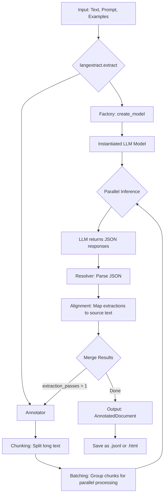

# LangExtract 專案說明

這份文件將詳細說明 LangExtract 專案，旨在幫助您全面了解其用途、功能、技術架構與應用潛力。

---

### 1. 本專案用途是什麼? 核心功能是什麼? 實際應用場景是什麼?

#### 專案用途與核心功能
想像一下，您有一本很長很厚的書（例如一本小說或一份報告），您想從中找出所有提到的人物、地點以及他們之間的關係。如果手動做，會非常耗時且容易出錯。

**LangExtract** 就是一個為了解決這類問題而設計的智慧工具。它像一個超級助理，能自動閱讀大量文字，並根據您的指示，準確地提取出您關心的特定資訊，並將這些資訊整理成結構化的資料（就像填表格一樣）。

它的核心功能是**「從非結構化文字中提取結構化資料」**。

最特別的一點是，它具備**「來源標註 (Source Grounding)」**能力。這意味著每一筆被提取出來的資料，LangExtract 都會精確地標示它在原文中的具體位置（從第幾個字到第幾個字）。這使得驗證資訊來源變得非常容易，確保了資料的準確性和可信度。

#### 實際應用場景
- **閱讀報告**：從數百頁的市場分析報告中，自動提取所有提到的公司名稱、產品和市場趨勢。
- **分析使用者回饋**：從上千則用戶評論中，自動抓取使用者抱怨的功能、建議的新功能以及他們的情緒。
- **整理病歷**：從醫生的文字病歷中，提取出藥物名稱、劑量、治療方案和病人症狀。
- **小說分析**：從一本小說中，提取所有角色的對話、他們在哪些章節出現過，以及他們的情感變化。

---

### 2. 本專案的 Input/Output 分別是什麼?

#### Input (輸入)
專案的主要輸入是透過 `langextract.extract()` 函式提供的，包含以下幾個關鍵部分：
1. **`text` (文字)**：您想要分析的原始文字內容，可以是一段話，也可以是整本書的內容。
2. **`prompt_description` (任務描述)**：用自然語言告訴 LangExtract 您想提取什麼。例如：「請從文字中提取所有人物的姓名和他們所在的城市。」
3. **`examples` (範例)**：提供一兩個簡單的範例，幫助 AI 更精準地理解您的需求。這就像教一個學生時，給他看幾個例題一樣。

**舉例說明 (以《羅密歐與茱麗葉》為例):**
- **`text`**: "Romeo, a Montague, is in love with Juliet, a Capulet from Verona."
- **`prompt_description`**: "Extract all characters and their family affiliations."
- **`examples`**: `[{"text": "Romeo", "label": "Character", "attributes": {"family": "Montague"}}]`

#### Output (輸出)
專案的最終產出是一個名為 `AnnotatedDocument` 的物件，它包含了所有提取到的資訊。您可以將這個物件存成 `.jsonl` 檔案或生成一個互動式的 HTML 視覺化報告。

這個輸出物件的核心是 `Extraction` 列表，每一筆 `Extraction` 都代表一項被提取出的資訊，包含：
1. **`text` (提取內容)**：被提取出來的文字，例如 "Romeo"。
2. **`label` (標籤)**：您定義的資訊類別，例如 "Character"。
3. **`attributes` (屬性)**：該資訊的附加屬性，例如 `{"family": "Montague"}`。
4. **`char_interval` (來源位置)**：這筆資訊在原文中的精確起點和終點位置，確保了可追溯性。

**舉例說明 (接續上例):**
最終產出的 `Extraction` 可能會是：
```json
{
  "text": "Romeo",
  "label": "Character",
  "attributes": {"family": "Montague"},
  "char_interval": [0, 5]
}
{
  "text": "Juliet",
  "label": "Character",
  "attributes": {"family": "Capulet"},
  "char_interval": [35, 41]
}
```
這個結果告訴我們，專案成功找到了 "Romeo" 和 "Juliet" 兩個角色，並標註了他們的家族和在原文中的位置。

---

### 3. 本專案用到那些 LLM ?

LangExtract 設計上非常有彈性，可以接入多種大型語言模型 (LLM)。它透過一個工廠模式 (`factory.py`) 來根據使用者指定的 `model_id` 選擇並載入對應的模型。

#### 支援的 LLM 供應商
- **Google Gemini**: 例如 `gemini/gemini-1.5-pro-latest`
- **OpenAI**: 例如 `openai/gpt-4o`
- **Azure OpenAI**: 透過 Azure 服務部署的 OpenAI 模型。
- **Ollama**: 支援在本機運行的開源模型，例如 `ollama/llama3`。
- **外掛擴充**: 專案還支援透過外掛程式機制，讓使用者自行擴充接入其他任何 LLM。

#### LLM 在專案中的作用
LLM 是整個提取過程的大腦。它的主要工作是：
1. **理解指令**：閱讀您提供的 `prompt_description` (任務描述) 和 `examples` (範例)。
2. **分析文字**：閱讀一小塊文字片段 (Chunk)。
3. **產生結果**：根據理解，以 JSON 格式回傳它在文字片段中找到的符合條件的資訊。

例如，當處理長文件時，LangExtract 會將文件切成多個小片段，然後將每個片段連同您的指令一起發送給 LLM，讓 LLM 分批處理，最後再將所有結果合併起來。

---

### 4. 調整配置參數會有哪些影響?

在呼叫 `langextract.extract()` 時，您可以調整多個參數來控制提取的行為和效能。以下是幾個關鍵參數的說明：

- **`model_id`**: **(最重要的參數)** 用於指定要使用哪個 LLM。不同的模型在速度、成本和提取品質上會有很大差異。例如，`gpt-4o` 可能效果最好但最貴，而本地的 `ollama/llama3` 則免費但需要較強的硬體。
- **`extraction_passes`**: 設定對整份文件進行幾輪提取。預設是 `1`。若設為 `2` 或更高，專案會重複掃描文件，有助於找出第一輪可能遺漏的資訊，能提高「召回率」，但也會增加處理時間和成本。
- **`max_workers`**: 設定同時運行的「工人」數量，用於平行處理文件的不同片段。增加此數值可以大幅加快長文件的處理速度，但也會增加瞬間的 API 請求量和記憶體消耗。
- **`max_char_buffer`**: 設定每個文字片段 (Chunk) 的最大長度。較小的值可以讓提示詞 (Prompt) 更短，有時能提高模型專注度和準確性，但會產生更多的 API 請求。較大的值則反之。
- **`temperature`**: LLM 的「創意溫度」。設為 `0` 會讓模型輸出更具決定性和一致性，適合需要高度準確性的任務。較高的值（如 `0.7`）會讓模型更具創意，但結果可能每次都不同。

---

### 5. 完整執行過程步驟與系統架構

#### 系統架構 (Mermaid 格式)


#### 完整執行步驟
1. **準備輸入**: 使用者準備好要分析的**原始文字**、描述任務的**提示 (Prompt)** 和一些**範例**。
2. **呼叫函式**: 使用者呼叫 `langextract.extract()` 函式並傳入上述參數。
3. **模型實例化 (Factory)**: 系統根據 `model_id` 參數，透過工廠 (`factory.py`) 選擇並初始化對應的 LLM 模型（例如 Gemini 或 OpenAI）。
4. **啟動標註器 (Annotator)**: 核心處理器 `Annotator` 開始工作。
5. **文本分塊 (Chunking)**: 如果文本很長，`Annotator` 會將其切割成多個較小的、可管理的**文字片段 (Chunks)**。
6. **平行處理 (Parallel Inference)**: `Annotator` 將多個文字片段連同提示打包，同時發送給 LLM 進行分析。這一步是並行的，以加快速度。
7. **結果解析 (Resolver)**: LLM 為每個片段返回提取結果（通常是 JSON 格式）。`Resolver` 模組負責解析這些 JSON 字串。
8. **來源對齊 (Alignment)**: `Resolver` 最關鍵的一步，是將解析出的提取結果與原始文本進行比對，計算出每條資訊精確的**起點和終點位置**。
9. **結果合併 (Merge)**: 如果設定了多輪提取 (`extraction_passes > 1`)，系統會將每一輪的結果合併，並解決可能出現的重疊。
10. **產出結果**: 所有片段處理完畢後，系統將所有提取到的資訊彙整成一個 `AnnotatedDocument` 物件，作為最終輸出。使用者可以進一步將其儲存或用於視覺化。

---

### 6. 本專案在公司內部有哪些應用方向?

LangExtract 的高精度和可追溯性使其在企業環境中極具價值：

- **客戶支援自動化**:
  - **應用**: 自動分析客服郵件、聊天紀錄和工單。
  - **舉例**: 從一封抱怨郵件中，自動提取「使用者帳號」、「遇到的問題類型（如：登入失敗）」、「涉及的產品模組」和「使用者的情緒（如：憤怒）」，並自動生成工單摘要。

- **法務合約智慧審查**:
  - **應用**: 快速從數百頁的法律合約中提取關鍵條款。
  - **舉例**: 自動標示出合約中的「簽約方名稱」、「生效日期」、「終止條款」、「賠償金額上限」和「管轄法院」等資訊，輔助法務人員快速審閱。

- **人力資源效率提升**:
  - **應用**: 自動化履歷篩選與分析。
  - **舉例**: 從收到的上千份履歷 PDF 或 Word 文件中，自動提取候選人的「姓名」、「聯絡方式」、「畢業學校」、「工作經歷（公司、職位、時間）」和「專業技能（如：Python, PMP）」，並存入人才庫。

- **金融財報分析**:
  - **應用**: 從上市公司的年度財報中提取關鍵財務數據和非結構化資訊。
  - **舉例**: 自動提取財報中的「總營收」、「淨利潤」、「研發支出」以及管理層在「未來展望」章節中提到的主要風險和機會。

---

### 7. 如果不依賴現有案例，要自行新增一個案例，建議新增哪個案例?

**建議新增案例：學術論文摘要提取**

#### 為什麼?
1. **高價值**: 科研人員每天需要閱讀大量論文，快速從論文中提取核心資訊（如研究方法、實驗數據、結論）能極大提升研究效率。
2. **格式複雜**: 學術論文雖然有固定結構，但其內文充滿了專業術語和複雜句式，非常適合展現 LangExtract 處理複雜文本的能力。
3. **長文本特性**: 一篇論文通常很長，能充分發揮 LangExtract 在長文本分塊、處理上的優勢。

#### 舉例說明
假設我們要從一篇關於新藥物研究的論文中提取資訊。

- **`text`**: (一篇完整的 PDF 論文文字內容)
- **`prompt_description`**: "從這篇生醫研究論文中，提取出研究中使用的**實驗方法**、**樣本數量**、**關鍵發現**以及所研究的**藥物名稱**。"
- **`examples`**:
  ```json
  [
    {
      "text": "We used a double-blind, placebo-controlled study design.",
      "label": "Method",
      "attributes": {"type": "Study Design"}
    },
    {
      "text": "A total of 250 patients were enrolled.",
      "label": "Sample Size",
      "attributes": {"count": 250}
    },
    {
      "text": "DrugX significantly reduced tumor size by 40%.",
      "label": "Key Finding",
      "attributes": {"drug": "DrugX", "effect": "reduced tumor size", "magnitude": "40%"}
    }
  ]
  ```

這個案例不僅實用，也能很好地展示 LangExtract 在專業領域的應用潛力。

---

### 8. 針對專案有哪些需要補充說明的部分?

- **外掛系統 (Plugin System)**: LangExtract 的一大亮點是其可擴充性。如果內建的 LLM 供應商不滿足需求，開發者可以遵循 `langextract/plugins.py` 的規範，輕鬆編寫自己的外掛來接入任何私有或新興的 LLM API。
- **視覺化工具 (Visualization)**: 專案提供了一個非常實用的視覺化功能。它可以將提取結果生成一個 HTML 檔案。在該檔案中，所有被提取的資訊都會在原文中被高亮標示，滑鼠懸停即可看到詳細的屬性。這對於除錯和結果驗證極為方便。
- **對長文本的優化**: 專案從設計之初就考慮了處理超長文本（如整本書）的挑戰。其內建的文本分塊、平行處理和結果合併機制，使其在處理數萬甚至數十萬字的文檔時依然保持高效和穩定。
